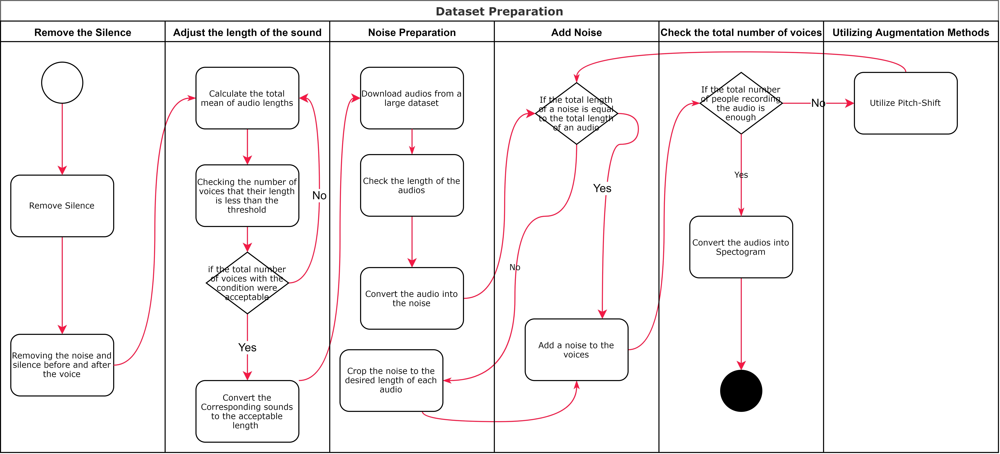

# VoxOracle Sentinel
Welcome to VoxOracle-Sentinel, a cutting-edge speech command system specifically designed for the Persian language.

## Table of Contents

- [Introduction](#introduction)
- [Architecture and Key Features Technology](#architecture-and-key-features-technology)
- [Project Structure](#project-structure)
- [Installation](#installation)
- [Build, Train and Test](#build-train-and-test)
- [Explore Our Kernel 🚀](#explore-our-kernel-)
- [Technology Stack](#technology-stack)
- [License](#license)
- [Contributions](#contributions)
- [Credits and Acknowledgements](#credits-and-acknowledgements)
- [Contact Information](#contact-information)


## Introduction
Welcome to VoxOracle-Sentinel, a cutting-edge speech command system specifically designed for the Persian language. At the heart of VoxOracle-Sentinel is a powerful voice recognition engine capable of understanding and executing over 30 unique Persian commands. This project represents a significant step forward in bridging the gap between human speech and technology, offering a natural and intuitive way for Persian-speaking users to interact with various applications and devices.

Developed with precision and user-friendliness in mind, VoxOracle-Sentinel aims to revolutionize the way we think about voice commands in a language rich with history and nuance. Whether you are looking to integrate voice command capabilities into your existing systems or exploring the realm of linguistic technology, VoxOracle-Sentinel offers a robust and scalable solution.

Join us on this exciting journey as we explore the possibilities of voice command technology in the Persian language, opening new avenues for innovation and interaction.

## Architecture and Key Features Technology

- **Advanced Voice Command Recognition:** At its heart, VoxOracle-Sentinel harnesses the powerful [Densenet](https://doi.ieeecomputersociety.org/10.1109/CVPR.2017.243) architecture, a model renowned for its performance in image classification, which we've ingeniously adapted for the domain of audio processing. This demonstrates the model's versatility and robustness, a point extensively discussed in the paper [Rethinking CNN Models for Audio Classification](https://www.researchgate.net/publication/343150435_Rethinking_CNN_Models_for_Audio_Classification). 


- **Attention Mechanism Integration:** 

1. ***NormalAttentionLayer***: This layer implements a basic form of attention mechanism. It creates trainable weights `W` and biases `b`. In its forward pass (`call` method), it applies a `tanh` activation function to the dot product of the input `x` and the weights `W`, adds the bias `b`, and then applies a softmax function. This results in an attention score (`a`) for each element in the input. The output is the element-wise multiplication of the input `x` and the attention scores, effectively allowing the layer to emphasize certain features in the input.

2. ***GAAPAttentionLayer***: This layer represents a more complex attention mechanism - the [Global Aerage Attention Pooling](https://thesai.org/Downloads/Volume13No7/Paper_96-Learning_Global_Average_Attention_Pooling_GAAP.pdf), specifically designed for processing sequences (e.g., time-series data or audio signals). It defines convolutional layers for query (`Q`), key (`K`), and value (`V`) transformations, essential components of the attention mechanism. It computes attention scores by applying a softmax function to the dot product of the query and key. These scores are then used to weigh the values. A unique aspect of this layer is the inclusion of a learnable `alpha` parameter, which is used to scale the output of the attention mechanism. This scaling factor is constrained between 0 and 1 and is learnable, allowing the model to adapt the influence of the attention mechanism during training. The layer concludes with a global average pooling operation, making it suitable for tasks that require summarizing sequential data into a fixed-size representation.

Both layers are versatile and can be integrated into various neural network architectures, enhancing their ability to focus on relevant features in the input data. They are especially useful in tasks where the identification and weighting of important input features significantly impact model performance, such as in time-series analysis, natural language processing, and complex signal processing tasks.


3. **R-Softmax for Sparsity:** VoxOracle-Sentinel introduces the innovative [R-Softmax](https://www.researchgate.net/publication/369945900_r-softmax_Generalized_Softmax_with_Controllable_Sparsity_Rate) function into its neural network architecture, a strategic move designed to tackle the inherent sparsity in audio data. In the landscape of audio classification, the sparsity challenge is characterized by the presence of only a select group of meaningful audio signals among a vast spectrum of potential inputs. Traditional Softmax functions often fall short in representing this sparse nature, leading to less discriminative models that cannot precisely distinguish between similar sounding phonetic nuances.

The R-Softmax function brings a game-changing regularization aspect to the traditional Softmax, promoting a model that is more selective and focused in its predictions. This is essential for the accurate interpretation of Persian speech commands, which require the model to discern subtle phonetic distinctions. By leveraging R-Softmax, VoxOracle-Sentinel stands out for its ability to deliver high-precision voice command detection, ensuring each command is captured with remarkable clarity, even in scenarios where data sparsity is prominent.


## Project Structure
The VoxOracle-Sentinel project is structured into several key directories, each with a specific focus and seperated README file:

- **[Audio Processing](./Audio%20Processing):** Scripts for audio data pre-processing such as silence trimming, noise addition, and pitch shifting.
- **[Data Preparation](./Data%20Preparation):** Scripts for dataset organization including audio mixing, counting audio durations, and file sorting based on volume.
- **[Evaluation](./Evaluation):** Contains evaluation scripts for the model, covering offline and online assessments, as well as streaming tests.
- **[Feature Extraction](./Feature%20Extraction):** Scripts dedicated to the extraction of meaningful features from audio data.
- **[Train](./Train):** Training scripts and model versions are maintained here, showcasing the model's evolution.


## Installation
Follow these steps to set up VoxOracle Sentinel on your system:

**1- Download the Pretrained Model Weights:**

- First, download the [pretrained model weight]().
- Place the downloaded file into the models directory within your VoxOracle Sentinel project folder.

**2- Install Required Libraries:**

- Open your terminal or command prompt.
- Navigate to the root directory of the VoxOracle Sentinel project.
- Run the following commands to install necessary libraries:
```bash
sudo apt update
sudo apt install ffmpeg libasound2-dev portaudio19-dev libportaudio2 libportaudiocpp0 python3-pyaudio python3-dev build-essential
```
```bash
pip install -r requirements.txt
```

**3- GPU-Support:**

Before installing VoxOracle-Sentinel, ensure that your system meets the following requirements for TensorFlow with GPU support:

- ***NVIDIA® GPU card*** with CUDA® architectures 3.5 and higher.
- ***NVIDIA® GPU drivers***: Version 450.80.02 or higher.
- ***CUDA® Toolkit***: Version 11.8.
- ***cuDNN SDK***: Version 8.6.0.
- ***Python***: Version 3.6 to 3.9.
- ***Operating System***:
  - Linux: Ubuntu 16.04 or higher (64-bit).
  - Windows: WSL2 with Windows 10 version 19044 or higher, for TensorFlow versions after 2.10.


If your system meets the requirements, install the GPU-supported version of TensorFlow to take advantage of accelerated computation:
```bash
pip install tensorflow[and-cuda]
```

Otherwise, if you do not have a GPU you can install the standard version of TensorFlow which will utilize your CPU for computation:
```bash
pip install tensorflow
```

## Build, Train and Test

### Dataset Preparation Pipeline

Our dataset preparation pipeline consists of several critical steps, each designed to optimize the audio data for machine learning models:



1. **Remove Silence**: Initially, we eliminate any silence from the audio tracks to focus on the significant portions containing voice or other sounds.

2. **Adjust the Length of the Sound**: We standardize the length of the audio clips, ensuring that they meet a predefined length requirement which is essential for uniformity in training data.

3. **Noise Preparation**: To improve the model's robustness, we augment the dataset by adding noise. This simulates a variety of listening environments.

4. **Check the Total Number of Voices**: To ensure a diverse dataset, we verify that the dataset contains a sufficient number of different speakers.

5. **Utilizing Augmentation Methods**: Finally, we apply audio augmentation techniques such as pitch shifting to further diversify our dataset, which helps in creating a more generalized model.

---
The usage of each pipeline has been closely observed and implemented. to use them please refer to the [Project Structure](#project-structure) section:

1. Try to find the desired length of audio by considering the total mean and max size of each audio:
```bash
cd ./Feature_Extraction
python silence_trimmed_length_finder.py ...
```

2. Count the total number of audios considering the chosen length of audio:
```bash
cd ./Data Preparation
python short_audio_counter.py ...
```

3. If and only if the total number of audios are acceptable considering the chosen audio length, proceed with padding and making change on audios:
```bash
cd ./Audio Processing
python audio_edge_silence_trim_and_pad.py ...
```

4. You can also create Noises with the following command:
```bash
cd ./Audio Processing
python make_noise.py ...
```

5. Aftre preparing noises, you are free to mix the noises with audios to create the desired dataset:
```bash
cd ./Data Preparation
python random_audio_mixer.py ...
```

6. Extract features from mixed audios by following the below command:
```bash
cd ./Feature_Extraction
python melspectogram_extractor.py ...
```

7. Split dataset and create train/validation/test set with the following command:
```bash
cd ./Data Preparation
python dataset_split.py ...
```

### Training The Model (Optional)
The model comes pre-trained. Retraining is optional and can be done with your prepared data.

```bash
cd ./Train
python train.py --logdir --epoch --b_size --classes --checkpoint_dir --train_csv --valid_csv --test_csv --in_shape --initial_sparsity_rate --softmax_type --attention_type
```

- `--logdir`: Path to save log files. Required.
- `--epoch`: Number of training epochs. Optional; default is 100.
- `--b_size`: Batch size for training. Optional; default is 16.
- `--classes`: Number of classes for the model to train. Required.
- `--checkpoint_dir`: Path to save model checkpoints. Required.
- `--train_csv`, `--valid_csv`, `--test_csv`: Paths to CSV files for training, validation, and test datasets, respectively. Required.
- `--in_shape`: Input shape of the model as a string ('height,width'). Optional; default is '128,191'.
- `--initial_sparsity_rate`: Initial sparsity rate for R-Softmax, if used. Optional; default is 0.5.
- `--softmax_type`: Type of softmax to use ('normal' or 'r_softmax'). Optional; default is 'normal'.
- `--attention_type`: Type of attention layer to use ('normal', 'gaap', or 'no_attention'). Optional; default is 'no_attention'.


### Testing the Model
Test the pre-trained model in various scenarios to assess its real-world application.

#### Offline Test
Test with prerecorded audio containing the key phrase.
```bash
cd ./Evaluation
python offline.py --model_pth --input --sr --labels_file --in_shape --attention_type --softmax_type --step --window_size --acc_thrs --initial_sparsity_rate --softmax_type --attention_type
```

- `--model_pth`: The path to your model weight.
- `--input`: The path to input audio.
- `--sr`: Desired sample rate of input audio.
- `--labels_file`: The path to the label's pickle file.
- `--in_shape`: Input shape of the model as a string ('height,width'). Optional; default is '128,211'.
- `--initial_sparsity_rate`: Initial sparsity rate for R-Softmax, if used. Optional; default is 0.5.
- `--softmax_type`: Type of softmax to use ('normal' or 'r_softmax'). Optional; default is 'normal'.
- `--attention_type`: Type of attention layer to use ('normal', 'gaap', or 'no_attention'). Optional; default is 'no_attention'.
- `--step`: The step size or stride of the sliding window. It determines how much the window moves for each subsequent analysis. A smaller step size means more overlap between consecutive windows and can lead to finer resolution in time, but at the cost of increased computational load. A step size of 0.4 seconds is a balance that allows for detailed analysis without excessive computation.
- `--window_size`: The size of the window used for analysis, measured in seconds. A window of 1.9 seconds will be used to slice the audio signal into segments for processing. The choice of window size is critical; a larger window can capture more temporal context but might mix different sound events, while a smaller window may focus on instantaneous features but at the risk of losing context.
- `--acc_thrs`: The threshold of evaluation accuracy. This threshold would omit prediction's blow the certain value.


#### Online Test
Test the model's responsiveness in real-time using a microphone.
```bash
cd ./Evaluation
python online.py --model_pth --labels_file --attention_type --softmax_type --initial_sparsity_rate --step --window_size --acc_thrs --in_shape --sr
```

- `--model_pth`: The path to your model weight.
- `--labels_file`: The path to the label's pickle file.
- `--attention_type`: Type of attention layer to use ('normal', 'gaap', or 'no_attention'). Optional; default is 'no_attention'.
- `--softmax_type`: Type of softmax to use ('normal' or 'r_softmax'). Optional; default is 'normal'.
- `--initial_sparsity_rate`: Initial sparsity rate for R-Softmax, if used. Optional; default is 0.5.
- `--step`: The step size or stride of the sliding window. It determines how much the window moves for each subsequent analysis. A smaller step size means more overlap between consecutive windows and can lead to finer resolution in time, but at the cost of increased computational load. A step size of 0.4 seconds is a balance that allows for detailed analysis without excessive computation.
- `--window_size`: The size of the window used for analysis, measured in seconds. A window of 1.9 seconds will be used to slice the audio signal into segments for processing. The choice of window size is critical; a larger window can capture more temporal context but might mix different sound events, while a smaller window may focus on instantaneous features but at the risk of losing context.
- `--acc_thrs`: The threshold of evaluation accuracy. This threshold would omit prediction's blow the certain value.
- `--in_shape`: Input shape of the model as a string ('height,width'). Optional; default is '128,211'.
- `--sr`: Desired sample rate of input audio.


# Explore Our Kernel 🚀
We are thrilled to unveil our cutting-edge kernel, an embodiment of innovation that integrates the audio manipulation capabilities of VoxArte Studio! It's not just a repository; it's a revolution in audio processing, built with our audio projects at its heart.

## Catch the Wave of Audio Innovation
Don't miss out on this opportunity to be a part of the audio evolution. Click the link blow, star the repo for future updates, and let your ears be the judge. If you're as passionate about audio as we are, we look forward to seeing you there!

Remember, the future of audio is not just heard; it's shared and shaped by enthusiasts and professionals alike. Let's make waves together with VoxArte Studio and our Kernel. 🚀

🔗 [Kernel Repository](https://github.com/Meta-Intelligence-Services)

---

For any queries or discussions regarding our kernel, feel free to open an issue in the kernel's repository, and we'll be more than happy to engage with you. Together, we're not just changing audio; we're making history!

## Technology Stack
VoxPulseSentinel is built on a foundation of powerful libraries and frameworks, each contributing to its robust functionality:

- **Pedalboard**: A Python library for adding effects to audio.
- **Wave**: A standard Python module for working with WAV files.
- **Pydub (0.25.1)**: A simple and easy-to-use Python module to work with audio data.
- **Soundfile (0.12.1)**: Enables reading and writing of audio files in various formats.
- **TQDM**: Offers a fast, extensible progress bar for loops and other iterative processing.
- **FFmpeg (1.4)**: A complete solution for recording, converting, and streaming audio and video.
- **NumPy (1.24.3)**: Essential for high-level mathematical functions and multi-dimensional arrays manipulation.
- **Pandas (2.1.1)**: Used for data manipulation and analysis, particularly useful for handling large data sets.
- **Librosa (0.10.1)**: A Python package for music and audio analysis, providing tools to analyze and extract audio features.
- **TensorFlow (2.13.0)**: A comprehensive open-source platform for machine learning, used for building and training the Densent model.
- **Scikit-learn (1.3.1)**: Implements a wide range of machine learning algorithms for medium-scale supervised and unsupervised problems.
- **PyAudio (0.2.13)**: Provides Python bindings for PortAudio, the cross-platform audio I/O library, crucial for audio capture and playback.
- **SoundDevice**: This Python module provides bindings for the PortAudio library and a few convenience functions to play and record NumPy arrays containing audio signals. The sounddevice module is available for Linux, macOS and Windows.
- **InaSpeechSegmenter (0.7.7)**: inaSpeechSegmenter is a CNN-based audio segmentation toolkit.It splits audio signals into homogeneous zones of speech, music and noise. Speech zones are split into segments tagged using speaker gender (male or female). Male and female classification models are optimized for French language since they were trained using French speakers (accoustic correlates of speaker gender are language dependent). Zones corresponding to speech over music or speech over noise are tagged as speech. inaSpeechSegmenter has been designed in order to perform large-scale gender equality studies based on men and women speech-time percentage estimation.
- **Singleton-Decorator**: A testable singleton decorator allows easily create a singleton objects just adding a decorator to class definition but also allows easily write unit tests for those classes.

---

Make sure to install all required libraries using the `requirements.txt` file - which exists in each project's directory - or manually install them with `pip` if necessary.

## License
VoxOracle Sentinel is open-sourced under the MIT License. See [LICENSE](LICENSE) for more details.

## Contributing
While we deeply value community input and interest in VoxOracle Sentinel, the project is currently in a phase where we're mapping out our next steps and are not accepting contributions just yet. We are incredibly grateful for your support and understanding. Please stay tuned for future updates when we'll be ready to welcome contributions with open arms.

## Contact Information
Although we're not open to contributions at the moment, your feedback and support are always welcome. Please feel free to star the project or share your thoughts through the Issues tab on GitHub, and we promise to consider them carefully.please [open an issue](https://github.com/Amir-Nassimi/VoxOracle-Sentinel/issues) in the VoxOracle Sentinel repository, and we will assist you.